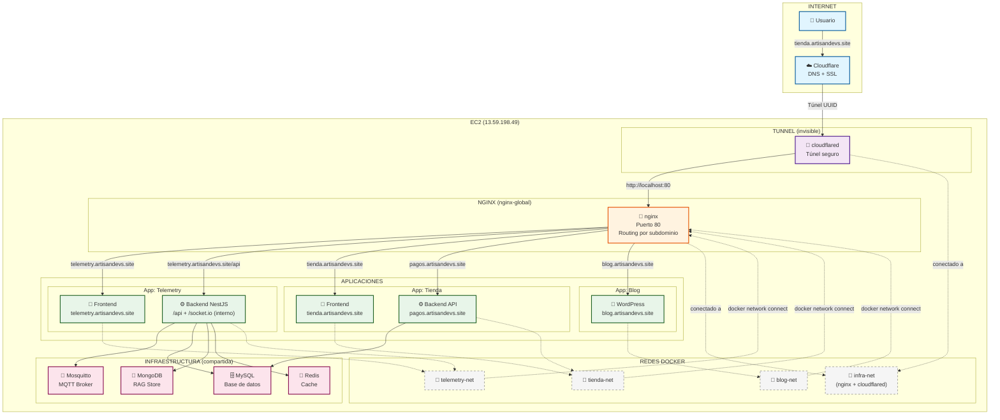
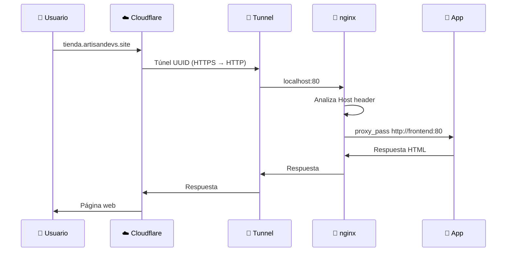
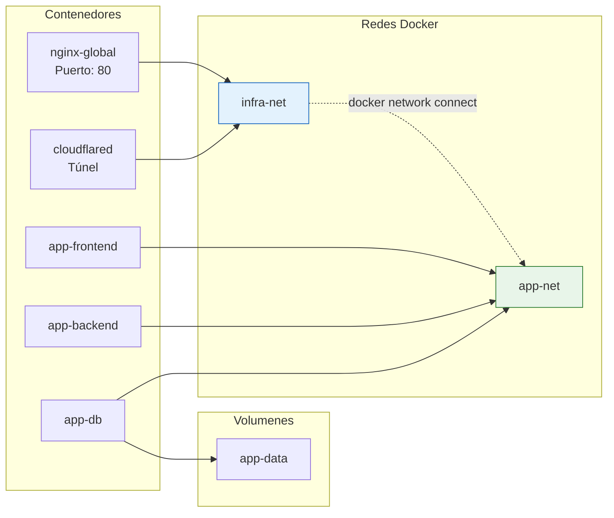
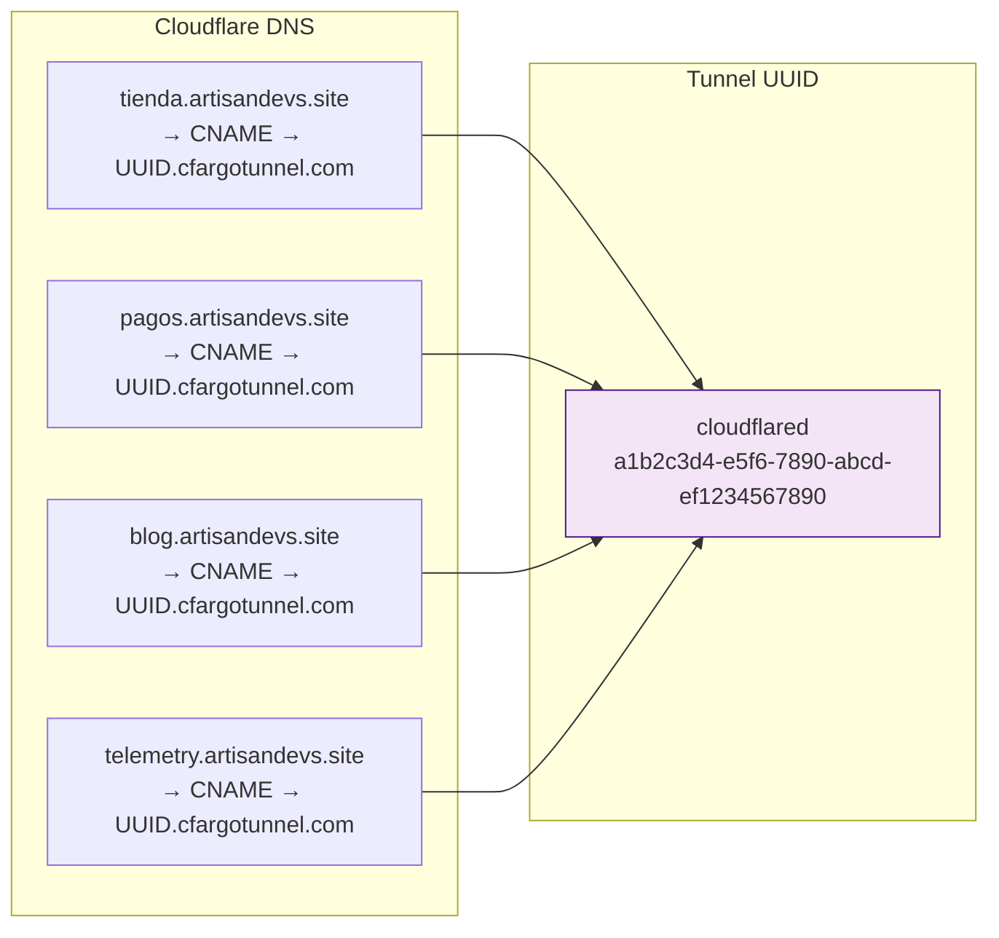

## Flujo de una petición



## Arquitectura Docker



## Estructura de archivos en EC2

```
/home/ec2-user/
├── .cloudflared/
│   ├── config.yml                    ← Configuración del tunnel
│   ├── <UUID>.json                   ← Credenciales del tunnel
│   └── cert.pem                      ← Certificado

/opt/infra/
├── docker-compose.yml                ← nginx + cloudflared
└── conf.d/
    ├── default.conf                  ← Catch-all (404)
    ├── telemetry.conf                ← Config de telemetry
    ├── tienda.conf                   ← Config de tienda
    └── blog.conf                     ← Config de blog

/opt/apps/
├── telemetry-platform/
│   ├── docker-compose.yml
│   ├── backend/
│   ├── frontend/
│   └── ...
├── tienda/
│   ├── docker-compose.yml
│   ├── frontend/
│   ├── backend/
│   └── ...
└── blog/
    ├── docker-compose.yml
    └── wordpress/
```

## Registro de subdominios


